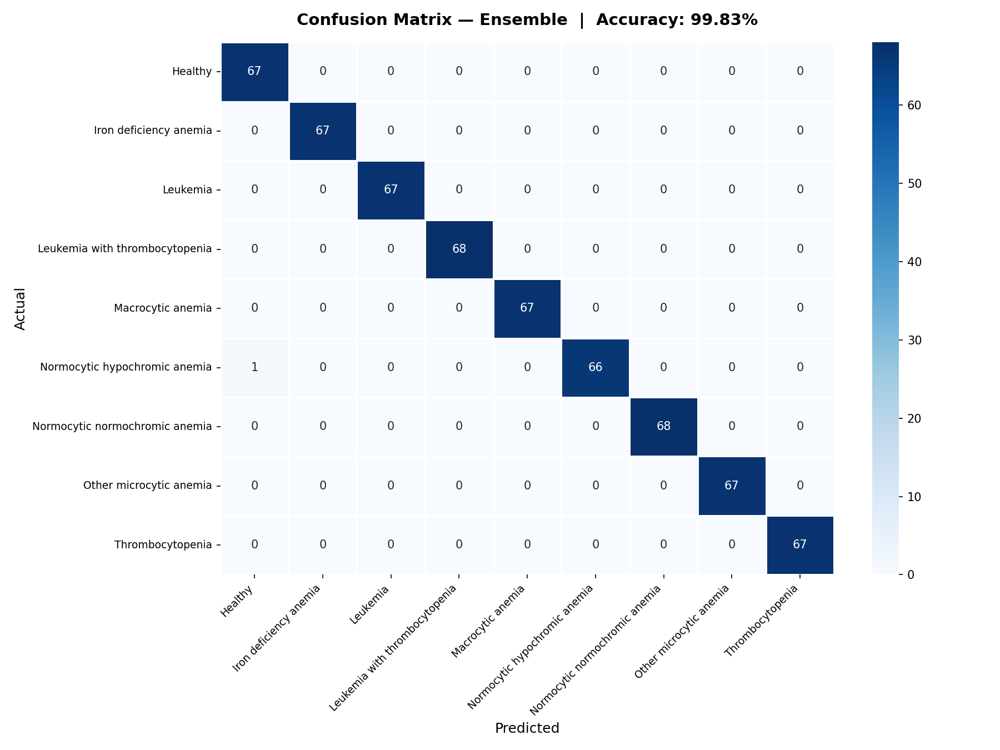
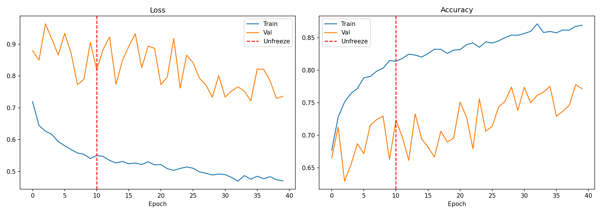
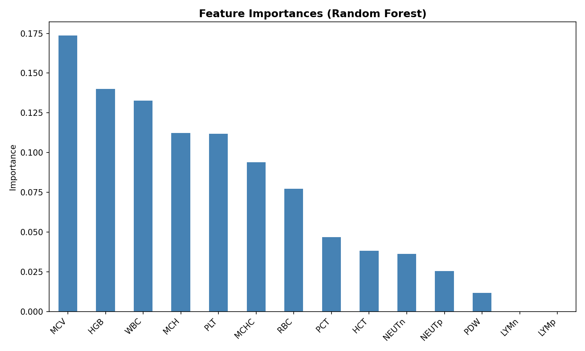
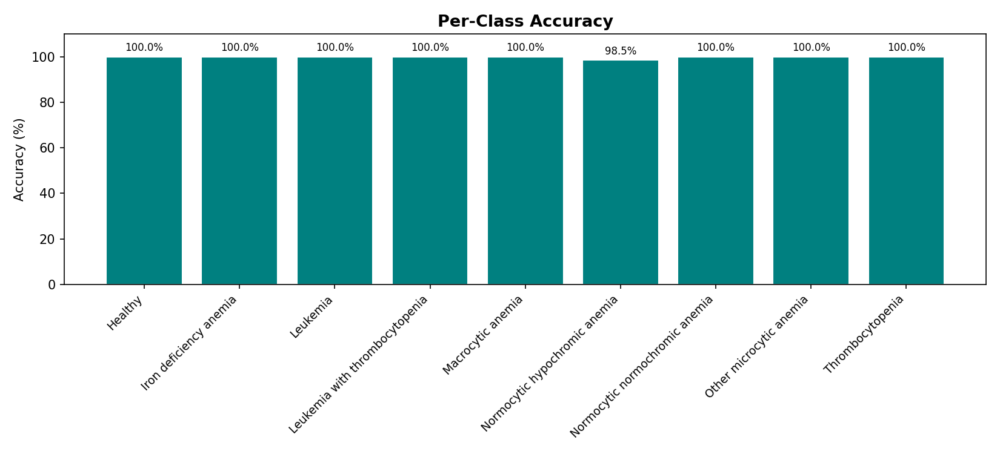

# 🏥 Doctor Assistant - AI-Powered Medical Diagnostic System

A comprehensive, production-ready medical diagnostic assistant that combines **multi-agent AI orchestration**, **machine learning models**, and **retrieval-augmented generation (RAG)** to provide intelligent medical consultations and treatment planning.


---

## 📋 Table of Contents

- [Live Deployment](#-live-deployment)
- [Overview](#-overview)
- [Key Features](#-key-features)
- [System Architecture](#-system-architecture)
- [Technology Stack](#-technology-stack)
- [How It Works](#-how-it-works)
- [ML Models](#-ml-models)
- [Installation & Setup](#-installation--setup)
- [Usage Guide](#-usage-guide)
- [API Documentation](#-api-documentation)
- [Docker Deployment](#-docker-deployment)
- [Project Structure](#-project-structure)
- [Innovation & Uniqueness](#-innovation--uniqueness)
- [Real-World Applications](#-real-world-applications)

---

## 🌐 Live Deployment

**The application is live and accessible at:**

- **Frontend (Web Application)**: [https://pulmo-ai-assistant-doctor.vercel.app/](https://pulmo-ai-assistant-doctor.vercel.app/)
- **Backend API**: [https://hassan7272-pulmoai-backend.hf.space](https://hassan7272-pulmoai-backend.hf.space)
- **API Documentation**: [https://hassan7272-pulmoai-backend.hf.space/docs](https://hassan7272-pulmoai-backend.hf.space/docs)
- **Health Check**: [https://hassan7272-pulmoai-backend.hf.space/health](https://hassan7272-pulmoai-backend.hf.space/health)

**Deployment Stack**: Vercel (frontend) · Hugging Face Spaces (backend) · Neon (PostgreSQL)  
**AI**: Google Gemini (primary) · Groq (fallback)  
**Status**: ✅ Production Ready

You can start using the application immediately by visiting the frontend URL above. Register a new account or login to begin a diagnostic session.

---

## 🎯 Overview

**Doctor Assistant** is an intelligent medical diagnostic system that guides patients through a complete diagnostic workflow:

1. **Patient Intake** - Collects comprehensive patient information
2. **Emergency Triage** - Detects life-threatening conditions
3. **Clinical Assessment** - Generates medical notes
4. **Test Collection** - Sequentially collects diagnostic tests (X-ray, Spirometry, CBC)
5. **AI Diagnosis** - Uses RAG to generate evidence-based diagnosis
6. **Treatment Planning** - Creates personalized treatment plans
7. **Report Generation** - Produces comprehensive PDF reports
8. **History Tracking** - Maintains patient visit history with progress analysis

### 🎨 What Makes This Unique?

- **Multi-Agent Architecture**: 10 specialized AI agents working in harmony
- **Three ML Models**: X-ray (87.82%), Spirometry (98.38%), and CBC (99.83%) analysis integrated seamlessly
- **RAG-Powered Diagnosis**: Evidence-based treatment using medical knowledge base
- **Intelligent Workflow**: LangGraph ensures strict, reliable sequence
- **Progress Tracking**: Compares current visit with historical data
- **Production-Ready**: Complete error handling, Docker support, comprehensive logging

---

## ✨ Key Features

### 🤖 Multi-Agent System
- **10 Specialized Agents**: Each handling a specific aspect of the diagnostic workflow
- **Hybrid routing (`intent_router.py`)**: Workflow steps use **rule-based supervisor** (fast, no LLM loop). Test commands use **pattern matching first**, then **LLM** (Gemini → Groq) when the user does not say exact words like "skip" or "form" — e.g. *"no need for cbc, just the lung test"* or *"I only want blood work"*
- **Dynamic test recommendations**: 1–3 tests (X-ray, CBC, Spirometry) chosen from symptoms — not always all three
- **State Persistence**: LangGraph SqliteSaver checkpoints; session survives across messages via `visit_id`
- **Error Recovery**: LLM quota cooldown → Groq; chat timeout → frontend recovers report from `/diagnostic/state/{visit_id}`

### 🔄 Real-Time WebSocket Streaming
- **Token-by-Token Streaming**: Live response generation via persistent WebSocket connection (`/diagnostic/ws`)
- **REST Fallback**: Automatic fallback to REST API if WebSocket connection drops
- **Connection Status Indicator**: Live (green), Reconnecting (orange), REST (gray) status in UI
- **Protocol**: Auth → Chat messages → `stream_start` / `stream_token` / `stream_end` frame types

### 🧠 Machine Learning Integration
- **X-ray Analysis**: EfficientNet-B3 model (87.82% accuracy) for pneumonia detection
- **Spirometry Analysis**: XGBoost ensemble (98.38% accuracy) for lung function patterns
- **CBC Analysis**: Voting Ensemble (99.83% accuracy) for blood disease prediction (9 classes)
- **Real-time Predictions**: Fast inference with confidence scores

### 📚 RAG System
- **Medical Knowledge Base**: Indexed medical guidelines and protocols
- **Semantic Search**: FAISS-based vector retrieval
- **Evidence-Based**: Citations to source documents
- **Dynamic Updates**: Add new medical documents on the fly

### 📄 Report Generation
- **Comprehensive PDFs**: Professional medical reports
- **Automatic Generation**: Created after treatment approval
- **Database Storage**: Linked to visit records
- **Downloadable**: Access via API endpoint

### 📊 Patient History
- **Visit Tracking**: Complete history of all consultations
- **Progress Analysis**: Compares current vs. previous visits
- **PDF Archive**: All reports stored and accessible
- **Trend Analysis**: Identifies improvements or concerns

---

## 🏗️ System Architecture

### High-Level Architecture

```
┌─────────────────────────────────────────────────────────────┐
│                      Frontend (React)                        │
│  ┌──────────┐  ┌──────────┐  ┌──────────┐  ┌──────────┐  │
│  │   Chat   │  │ Dashboard │  │  Forms   │  │  History │  │
│  │  (WS)    │  │          │  │          │  │          │  │
│  └────┬─────┘  └────┬─────┘  └────┬─────┘  └────┬─────┘  │
└───────┼──────────────┼──────────────┼──────────────┼────────┘
        │              │              │              │
        └──────────────┼──────────────┼──────────────┘
                       │              │
        ┌──────────────▼──────────────▼──────────────┐
        │         FastAPI Backend (Port 8000)         │
        │  ┌──────────────────────────────────────┐  │
        │  │  API Endpoints (REST + WebSocket)    │  │
        │  │  • /diagnostic/ws  (real-time)       │  │
        │  │  • /diagnostic/*   (REST fallback)   │  │
        │  └──────────────┬───────────────────────┘  │
        │                 │                          │
        │  ┌──────────────▼───────────────────────┐ │
        │  │  LangGraph Workflow Engine            │ │
        │  │  (Shared singleton + SqliteSaver)     │ │
        │  │  ┌──────────────────────────────────┐ │ │
        │  │  │  Supervisor + intent_router      │ │ │
        │  │  │  (rules + pattern + LLM fallback) │ │ │
        │  │  └──────────┬───────────────────────┘ │ │
        │  │             │                          │ │
        │  │  ┌──────────▼───────────────────────┐ │ │
        │  │  │  10 Specialized Agents            │ │ │
        │  │  │  • Patient Intake                │ │ │
        │  │  │  • Emergency Detector            │ │ │
        │  │  │  • Test Collector                │ │ │
        │  │  │  • RAG Specialist                │ │ │
        │  │  │  • Report Generator              │ │ │
        │  │  │  • ... and 5 more                │ │ │
        │  │  └──────────┬───────────────────────┘ │ │
        │  └─────────────┼──────────────────────────┘ │
        │                │                            │
        │  ┌─────────────▼──────────────────────────┐ │
        │  │         Tools & Services               │ │
        │  │  • ML Models (X-ray, Spirometry, CBC)  │ │
        │  │  • RAG System                          │ │
        │  │  • PDF Generator                       │ │
        │  │  • Database (SQLAlchemy)               │ │
        │  │  • LLM (Gemini primary / Groq fallback) │ │
        │  └────────────────────────────────────────┘ │
        └─────────────────────────────────────────────┘
```

### Multi-Agent Workflow

```
┌─────────────────────────────────────────────────────────────┐
│                    LangGraph Workflow                        │
│                                                               │
│  START                                                       │
│    │                                                         │
│    ▼                                                         │
│  ┌──────────────────┐                                        │
│  │ Patient Intake  │ → Extract & Validate Patient Info     │
│  └────────┬────────┘                                        │
│           │                                                  │
│           ▼                                                  │
│  ┌──────────────────┐                                        │
│  │Emergency Detector│ → Check for Life-Threatening          │
│  └────────┬────────┘                                        │
│           │                                                  │
│           ▼                                                  │
│  ┌──────────────────┐                                        │
│  │ Doctor Note Gen  │ → Clinical Assessment                 │
│  └────────┬────────┘                                        │
│           │                                                  │
│           ▼                                                  │
│  ┌──────────────────┐                                        │
│  │ Test Collector   │ → Collect recommended tests only     │
│  │                  │   (1–3 of X-ray / Spirometry / CBC)  │
│  └────────┬────────┘                                        │
│           │                                                  │
│           ▼                                                  │
│  ┌──────────────────┐                                        │
│  │ RAG Specialist   │ → Diagnosis + Treatment Plan         │
│  └────────┬────────┘                                        │
│           │                                                  │
│           ▼                                                  │
│  ┌──────────────────┐                                        │
│  │Treatment Approval│ → Wait for User Approval             │
│  └────────┬────────┘                                        │
│           │                                                  │
│           ▼                                                  │
│  ┌──────────────────┐                                        │
│  │Report Generator  │ → Generate PDF + Calculate Dosages   │
│  └────────┬────────┘                                        │
│           │                                                  │
│           ▼                                                  │
│  ┌──────────────────┐                                        │
│  │ History Saver    │ → Save to Database                   │
│  └────────┬────────┘                                        │
│           │                                                  │
│           ▼                                                  │
│  ┌──────────────────┐                                        │
│  │ Follow-up Agent  │ → Progress Comparison                │
│  └────────┬────────┘                                        │
│           │                                                  │
│           ▼                                                  │
│         END                                                  │
└─────────────────────────────────────────────────────────────┘
```

### Data Flow

```
User Input → WebSocket/REST → LangGraph → Agent → Tools → LLM/ML → Response
                  │                │         │       │       │         │
                  │                │         │       │       │         │
                  ▼                ▼         ▼       ▼       ▼         ▼
              Shared           Checkpoint  Update  Execute  Process  Stream
              Graph             Save       State   Tool     Data     Tokens
              Instance
```

---

## 🛠️ Technology Stack

### Backend
- **FastAPI** - Modern Python web framework (REST + WebSocket)
- **LangGraph** - Multi-agent workflow orchestration with SqliteSaver checkpointing
- **SQLAlchemy** - Database ORM
- **Google Gemini** (primary) + **Groq** (fallback) — see `backend/app/agents/config.py`
- **PyTorch** - Deep learning (X-ray model)
- **XGBoost** - Gradient boosting (Spirometry, CBC)
- **FAISS** - Vector similarity search (RAG)
- **ReportLab** - PDF generation
- **Pydantic** - Data validation

### Frontend
- **React 18** - UI framework
- **TypeScript** - Type safety
- **Vite** - Build tool
- **TailwindCSS** - Styling
- **Axios** - HTTP client (REST fallback)
- **Native WebSocket** - Real-time streaming with auto-reconnect
- **React Router** - Navigation
- **React Hot Toast** - Notifications

### Infrastructure (production)
- **Vercel** — frontend hosting
- **Hugging Face Spaces** — backend API (Docker)
- **Neon** — PostgreSQL (`DATABASE_URL`)
- **Git LFS** — ML model weights on HF Space repo (`hf-space-deploy/`)
- **Docker** — optional for local dev; see `DEPLOY.md`

---

## 🔄 How It Works

### 1. Patient Intake Flow

```
User: "name hassan age 21 weight 60kg gender male smoker yes symptoms chest pain..."

    ↓
    
Patient Intake Agent:
  • Extracts structured data using LLM
  • Validates required fields
  • Shows confirmation prompt
  
    ↓
    
User: "Yes, that is correct"

    ↓
    
State Updated: patient_data_confirmed = True
```

### 2. Test Collection Flow

```
Supervisor → Test Collector Agent

    ↓
    
Agent: "Based on symptoms, I recommend: XRAY, CBC" (example — count varies 1–3)

    ↓
    
User: "no cbc please, only spirometry" or "skip xray give cbc form"
    (pattern match OR LLM parses informal wording)

    ↓
    
Frontend: Shows Spirometry form modal

    ↓
    
User: Submits FEV1=5, FVC=5

    ↓
    
Test Collector:
  • Calls ML model (Spirometry)
  • Gets prediction: Pattern=Normal, Confidence=95%
  • Updates state: spirometry_result = {...}
  • Asks for next test: "Thank you. Next, I need your X-ray..."
```

### 3. RAG Diagnosis Flow

```
All Tests Collected → Supervisor → RAG Specialist Agent

    ↓
    
RAG Specialist:
  • Builds query from symptoms + test results
  • Searches medical knowledge base (FAISS)
  • Retrieves relevant documents
  • Calls LLM with context + retrieved docs
  
    ↓
    
LLM Generates:
  • Diagnosis: "Viral Pneumonia"
  • Treatment Plan: ["Amoxicillin 500mg...", ...]
  • Home Remedies: ["Rest and hydration", ...]
  • Follow-up: "Return in 7 days..."
  
    ↓
    
State Updated: diagnosis, treatment_plan, home_remedies, followup_instruction
```

### 4. Report Generation Flow

```
User: "approve this plan"

    ↓
    
Treatment Approval Agent:
  • Sets treatment_approved = True
  
    ↓
    
Report Generator Agent:
  • Calculates medication dosages (LLM)
  • Generates comprehensive report (LLM)
  • Creates PDF (ReportLab)
  • Saves PDF path to database
  
    ↓
    
History Saver Agent:
  • Saves visit to database
  • Links PDF report
  • Generates visit_id
  
    ↓
    
Follow-up Agent:
  • Fetches previous visits
  • Compares current vs. past
  • Generates progress summary
  
    ↓
    
Final Response: Complete report + progress analysis
```

---

## 🧪 ML Models

### 1. X-ray Pneumonia Detection

**Model**: EfficientNet-B3 + TTA (PyTorch)  
**Input**: Chest X-ray image (224x224)  
**Output**:
- Class: NORMAL / BACTERIAL / VIRAL
- Confidence scores for each class
- Probabilities distribution

**Location**: `backend/app/ml_models/xray/`

**Training Details**:
- 2-Phase training: Warm-up (frozen backbone) → Full fine-tune
- Class-weighted loss with label smoothing
- Test-Time Augmentation (TTA) with 5 transforms
- 87.82% test accuracy, 86.97% macro F1

**Usage**:
```python
from app.ml_models.xray import predict_xray
result = predict_xray(image_path)
# Returns: {"disease_name": "Viral pneumonia", "confidence": 0.644}
```

### 2. Spirometry Analysis

**Model**: XGBoost Ensemble (4 models)  
**Input**: FEV1, FVC, and derived features  
**Output**:
- Pattern: Normal / Obstruction / Restriction / Mixed
- Severity: Normal / Mild / Moderate / Severe
- Confidence score

**Location**: `backend/app/ml_models/spirometry/`

**Usage**:
```python
from app.ml_models.spirometry import predict_spirometry
result = predict_spirometry(fev1=5.0, fvc=5.0)
# Returns: {"pattern": "Normal", "severity": "Normal", "confidence": 0.95}
```

### 3. CBC Blood Test Analysis

**Model**: Voting Ensemble (Random Forest + XGBoost + Gradient Boosting)  
**Input**: 14 blood parameters (WBC, RBC, HGB, MCV, MCH, PLT, etc.)  
**Output**:
- Disease prediction (9 disease classes)
- Confidence score
- Class probabilities

**Location**: `backend/app/ml_models/bloodcount_report/`

**Training Details**:
- Dataset: Anemia Types Classification (Kaggle) - 4,680 samples
- Preprocessing: RobustScaler, IQR outlier capping, SMOTE balancing
- 5-Fold Stratified Cross-Validation
- **99.83% test accuracy**

**Usage**:
```python
from app.ml_models.bloodcount_report import predict_blood_disease
result = predict_blood_disease(wbc=7.0, rbc=4.5, hgb=14.0, ...)
# Returns: {"disease_name": "Healthy", "confidence": 0.99}
```

---

## 📊 Model Performance Metrics

### X-Ray Pneumonia Detection



**Model**: EfficientNet-B3 + TTA (5 augmentation transforms)

| Metric | Value |
|--------|-------|
| **Test Accuracy** | **87.82%** |
| **Best Val Accuracy** | 77.78% |
| **Macro F1** | 86.97% |

**Per-Class Performance**:

| Class | Precision | Recall | F1-Score | Support |
|-------|-----------|--------|----------|---------|
| **BACTERIAL** | 92.31% | 89.26% | 90.76% | 242 |
| **NORMAL** | 97.58% | 86.32% | 91.61% | 234 |
| **VIRAL** | 71.04% | 87.84% | 78.55% | 148 |

**Test Dataset**: 624 real X-ray images (234 NORMAL, 242 BACTERIAL, 148 VIRAL)



### Spirometry Analysis
- **Overall Accuracy**: 98.38%
- **Per-Condition Accuracy**:
  - Obstruction: 98.5%
  - Restriction: 98.0%
  - PRISm: 97.0%
  - Mixed: 100.0%
- **Test Dataset**: 200 real patient spirometry records

### Blood Count Disease Prediction



**Model**: Voting Ensemble (Random Forest + XGBoost + Gradient Boosting with Soft Voting)

| Metric | Value |
|--------|-------|
| **Test Accuracy** | **99.83%** |
| **Macro Avg Precision** | 99.84% |
| **Macro Avg Recall** | 99.83% |
| **Macro Avg F1** | 99.83% |

**Per-Class Performance (9 Classes):**

| Class | Precision | Recall | F1-Score |
|-------|-----------|--------|----------|
| **Healthy** | 98.53% | 100.00% | 99.26% |
| **Iron deficiency anemia** | 100.00% | 100.00% | 100.00% |
| **Leukemia** | 100.00% | 100.00% | 100.00% |
| **Leukemia + Thrombocytopenia** | 100.00% | 100.00% | 100.00% |
| **Macrocytic anemia** | 100.00% | 100.00% | 100.00% |
| **Normocytic hypochromic anemia** | 100.00% | 98.51% | 99.25% |
| **Normocytic normochromic anemia** | 100.00% | 100.00% | 100.00% |
| **Other microcytic anemia** | 100.00% | 100.00% | 100.00% |
| **Thrombocytopenia** | 100.00% | 100.00% | 100.00% |

**Test Dataset**: 605 samples (4,680 total from Anemia Types Classification dataset)

**Training Details**:
- Preprocessing: RobustScaler, IQR outlier capping (Q1-3×IQR, Q3+3×IQR)
- Balancing: SMOTE for class imbalance
- Validation: 5-Fold Stratified Cross-Validation
- CV Accuracy: 99.8% ± 0.2%




---

## ✅ Quality Assurance & Testing

This project includes comprehensive quality assurance measures ensuring production-ready reliability:

### 1. Comprehensive Test Suite

**Coverage**: 59 test cases with 96.6% pass rate

- **Agent Tests**: Validates all 10 specialized agents (Patient Intake, Emergency Detector, Supervisor, Test Collector, RAG Specialist, etc.)
- **API Tests**: Full endpoint coverage for diagnostic workflow, lab results, imaging, spirometry, and RAG operations
- **ML Model Tests**: Unit tests for X-ray, Spirometry, and Blood Count prediction models
- **Database Tests**: CRUD operations, relationships, and data integrity
- **RAG Tests**: Vector store operations, document retrieval, and semantic search

**Test Framework**: Pytest with fixtures, mocking, and test isolation

**Location**: `backend/tests/`

**Run Tests**:
```bash
cd backend
pytest tests/ -v
pytest tests/ --cov=app --cov-report=html  # With coverage
```

### 2. Performance Monitoring & Benchmarks

**Real-Time Metrics**:
- **API Response Times**: Automatic logging of all endpoint response times with P95/P99 percentiles
- **ML Inference Benchmarks**: 
  - X-ray: 0.41s avg (prediction), 0.26s avg (probability)
  - Spirometry: 0.02s avg (prediction), 0.02s avg (probability)
  - Blood Count: 0.02s avg (prediction), 0.02s avg (probability)
- **RAG Retrieval Metrics**: Document retrieval times and accuracy
- **Database Query Performance**: Query execution time tracking

**Performance Endpoints**:
- `GET /metrics/performance` - Real-time performance statistics
- `GET /health` - System health check

**Benchmark Scripts**:
- `scripts/benchmark_ml_models.py` - ML model inference benchmarks
- `scripts/benchmark_rag.py` - RAG retrieval performance
- `scripts/benchmark_database.py` - Database query benchmarks
- `scripts/run_all_benchmarks.py` - Comprehensive benchmark suite

**Location**: `backend/app/core/performance.py`, `backend/app/core/middleware.py`

### 3. Model Validation & Evaluation

**Automated Evaluation System**:
- **Accuracy Metrics**: Precision, Recall, F1 Score for all models
- **Confusion Matrices**: Per-class performance analysis
- **Real Dataset Integration**: Evaluation on real medical data
- **Validation Reports**: JSON reports with comprehensive metrics

**Evaluation Scripts**:
- `scripts/evaluate_models.py` - Complete model evaluation suite
- `scripts/generate_model_report.py` - Detailed validation reports with visualizations

**Validation Results**:
- Reports saved in `backend/model_validation_reports/`
- API endpoint: `GET /model-validation/reports` - Access validation reports programmatically

**Test Datasets**:
- X-ray: 624 images from Kaggle Chest X-Ray Pneumonia dataset
- Spirometry: 200 real patient records from medical dataset
- Blood Count: 605 test samples (4,680 total from Anemia Types Classification dataset)

**Run Evaluation**:
```bash
cd backend
python scripts/evaluate_models.py
```

### Testing Infrastructure

- **Test Database**: Isolated SQLite database for testing
- **Fixtures**: Reusable test data and mock objects
- **Test Isolation**: Each test runs independently
- **Coverage Reports**: HTML coverage reports generated
- **CI/CD Ready**: Tests can be integrated into GitHub Actions

---

## 🚀 Installation & Setup

### Prerequisites

- Python 3.11+
- Node.js 18+
- Docker (optional, for containerized deployment)
- Tesseract OCR (for PDF processing)

### Option 1: Local Development

#### Backend Setup

```bash
# Navigate to backend
cd backend

# Create virtual environment
python -m venv venv
source venv/bin/activate  # Windows: venv\Scripts\activate

# Install dependencies
pip install -r requirements.txt

# Set up environment variables
cp .env.example .env
# Edit .env and add your API keys

# Initialize database
python run_migration.py

# Run server
uvicorn app.main:app --reload --port 8000
```

#### Frontend Setup

```bash
# Navigate to frontend
cd frontend

# Install dependencies
npm install

# Set up environment (optional)
# Create .env file with VITE_API_BASE_URL=http://localhost:8000

# Run development server
npm run dev
```

### Option 2: Docker Deployment

```bash
# Create .env file in root directory
cp .env.example .env
# Add your API keys

# Build and run
docker-compose up --build

# Access application
# Frontend: http://localhost
# Backend: http://localhost:8000
# API Docs: http://localhost:8000/docs
```

See `DOCKER_SETUP.md` for detailed Docker instructions.

---

## 📖 Usage Guide

### For End Users (Patients)

1. **Register/Login** - Create account or sign in
2. **Start Diagnostic** - Click "Start Diagnostic" button
3. **Provide Information** - Enter your details when prompted
4. **Confirm Details** - Review and confirm your information
5. **Submit Tests** - Upload X-ray, fill Spirometry/CBC forms
6. **Review Treatment** - Read diagnosis and treatment plan
7. **Approve Plan** - Approve to generate final report
8. **Download Report** - Access PDF report from dashboard

### For Developers/API Users

#### Start Diagnostic Session

```bash
curl -X POST http://localhost:8000/diagnostic/start \
  -H "Authorization: Bearer YOUR_TOKEN" \
  -H "Content-Type: application/json"
```

#### Send Chat Message

```bash
curl -X POST http://localhost:8000/diagnostic/chat \
  -H "Authorization: Bearer YOUR_TOKEN" \
  -F "message=name hassan age 21 symptoms chest pain" \
  -F "visit_id=abc123"
```

#### Get Patient History

```bash
curl -X GET http://localhost:8000/visits/by_patient/3 \
  -H "Authorization: Bearer YOUR_TOKEN"
```

#### Download PDF Report

```bash
curl -X GET http://localhost:8000/visits/abc123/report \
  -H "Authorization: Bearer YOUR_TOKEN" \
  -o report.pdf
```

**Full API Documentation**: http://localhost:8000/docs

---

## 📁 Project Structure

```
Doctor-Assistant/
├── backend/                    # FastAPI backend
│   ├── app/
│   │   ├── agents/            # Multi-agent system
│   │   │   ├── graph.py       # LangGraph workflow
│   │   │   ├── supervisor.py # Rule-based workflow orchestrator
│   │   │   ├── intent_router.py # Test commands + approval intent (pattern + LLM)
│   │   │   ├── patient_intake.py
│   │   │   ├── emergency_detector.py
│   │   │   ├── test_collector.py
│   │   │   ├── rag/          # RAG system
│   │   │   └── tools.py      # Shared tools
│   │   ├── core/             # Core utilities
│   │   ├── db_models/         # Database models
│   │   ├── fastapi_routers/  # API endpoints (REST + WebSocket)
│   │   ├── ml_models/         # ML model implementations
│   │   └── main.py           # FastAPI app
│   ├── Dockerfile
│   ├── requirements.txt
│   └── README.md
│
├── frontend/                   # React frontend
│   ├── src/
│   │   ├── components/       # React components
│   │   ├── pages/            # Page components
│   │   ├── services/         # API services
│   │   └── contexts/         # React contexts
│   ├── Dockerfile
│   ├── nginx.conf
│   └── package.json
│
├── hf-space-deploy/          # HF Space git clone → push backend live
├── docker-compose.yml         # Docker orchestration (local)
├── DEPLOY.md                 # Vercel + HF + Neon deploy guide
├── TESTING_GUIDE.md          # Testing instructions
└── README.md                 # This file
```

---

## 💡 Innovation & Uniqueness

### 1. **Multi-Agent Orchestration**
Unlike single-prompt systems, this uses **10 specialized agents**:
- Each agent has a specific responsibility
- Supervisor ensures correct sequence
- State is persisted across agents
- Enables complex, multi-step workflows

### 2. **Hybrid AI Approach**
Combines three AI paradigms:
- **LLM Reasoning** (Gemini / Groq) - Natural language understanding
- **ML Models** (PyTorch/XGBoost) - Medical image/data analysis
- **RAG** (FAISS) - Evidence-based knowledge retrieval

### 3. **Structured LLM Outputs via Pydantic**
Type-safe LLM response handling:
- **Pydantic models** (`PatientExtraction`, `RAGTreatmentPlanOutput`, `DosageOutput`) validate and normalize all LLM JSON outputs
- **Field validators** auto-coerce malformed responses: nested dicts→flat strings, string ages→int, "yes"→bool
- **AgentStateValidator** provides typed state initialization with defaults — single source of truth across REST, WebSocket, and tests
- Zero manual `isinstance()` chains — Pydantic handles all edge cases declaratively

### 4. **Hybrid Intent Routing**
Three layers — fast when possible, smart when needed:
- **Supervisor (workflow)**: Rule-based — intake → emergency → clinical note → tests → RAG → approval → report. No LLM per hop (avoids loops and quota burn).
- **Test commands (`parse_test_actions`)**: Regex/patterns first (`skip cbc`, `only spirometry`, typo `cray`→xray). If no match → **LLM** interprets natural language (*"don't need blood test"*, *"just open the breathing form"*).
- **Safety nets**: Pending tests block treatment until done/skipped; approval required before report.

### 5. **Sequential Test Collection**
- Recommends **1–3 tests** from symptoms (LLM + heuristic, not fixed triple)
- Collects one at a time with skip/form/upload commands
- RAG diagnosis runs only after all **recommended** tests are done or skipped

### 6. **Progress Tracking**
Unique feature:
- Compares current visit with history
- Identifies improvements or concerns
- Provides continuity of care
- Helps track treatment effectiveness

### 7. **Comprehensive Error Handling**
Production-grade error handling:
- LLM retry logic with exponential backoff
- Automatic fallback between providers
- Graceful degradation
- User-friendly error messages

---

## 🌍 Real-World Applications

### Healthcare Providers
- **Telemedicine**: Remote patient consultations
- **Triage System**: Prioritize urgent cases
- **Clinical Decision Support**: Assist doctors with diagnosis
- **Patient Education**: Explain conditions and treatments

### Medical Institutions
- **Workflow Automation**: Streamline diagnostic processes
- **Quality Assurance**: Standardize diagnostic procedures
- **Training Tool**: Educate medical students
- **Research**: Analyze diagnostic patterns

### Patients
- **Self-Assessment**: Understand symptoms before doctor visit
- **Treatment Tracking**: Monitor progress over time
- **Medical Records**: Maintain personal health history
- **Accessibility**: 24/7 availability

### Developers/Researchers
- **API Integration**: Integrate into existing systems
- **ML Model Benchmarking**: Test new models
- **Workflow Research**: Study multi-agent systems
- **RAG Applications**: Explore knowledge retrieval

---

## 🔐 Security & Privacy

- **JWT Authentication**: Secure user sessions
- **Password Hashing**: Bcrypt encryption
- **Input Validation**: Pydantic schemas
- **SQL Injection Protection**: SQLAlchemy ORM
- **CORS Configuration**: Controlled API access
- **Error Sanitization**: No sensitive data in errors

---

## 📊 Performance

- **FastAPI**: Async endpoints for high concurrency
- **Model Caching**: ML models loaded once
- **Vector Store**: FAISS for fast similarity search
- **Database Pooling**: Efficient connection management
- **Health Checks**: Monitor system status

---

## 🐳 Deployment

**Production (current):** See **`DEPLOY.md`** — Vercel (frontend) + Hugging Face Space (backend) + Neon (DB).  
GitHub push alone does **not** update the HF backend; use the `hf-space-deploy/` repo.

### Docker (local / optional)

### Option 1: Use Pre-Built Images (local dev)

**Best for**: Quick local testing — not the live Vercel/HF stack

**Pre-built Docker Hub Images:**
- `mhassanshahbaz/doctor-assistant-frontend:latest` (React + Nginx)
- `mhassanshahbaz/doctor-assistant-backend:latest` (FastAPI + Python)

#### Quick Start (5 minutes)
```bash
# Pull and run backend
docker run -d \
  --name doctor-backend \
  -p 8000:8000 \
  -e OPENAI_API_KEY=your_openai_key \
  -e GROQ_API_KEY=your_groq_key \
  mhassanshahbaz/doctor-assistant-backend:latest

# Pull and run frontend
docker run -d \
  --name doctor-frontend \
  -p 80:80 \
  mhassanshahbaz/doctor-assistant-frontend:latest

# Access: http://localhost
```

#### Production Deployment
```bash
# Create .env file
cat > .env << 'EOF'
DOCKER_HUB_USERNAME=mhassanshahbaz
OPENAI_API_KEY=your_openai_key
GROQ_API_KEY=your_groq_key
EOF

# Pull pre-built images and deploy
docker-compose -f docker-compose.prod.yml pull
docker-compose -f docker-compose.prod.yml up -d
```

### Option 2: CI/CD Pipeline (Automated Builds)

**Best for**: Development workflow, custom modifications

1. **Set up GitHub Actions** (see `DEPLOYMENT_GUIDE.md`):
   - Configure Docker Hub secrets in GitHub
   - Push code to trigger automatic builds
   - Images built on GitHub, pushed to Docker Hub

2. **Deploy updates**:
```bash
# Pull latest images and restart
docker-compose -f docker-compose.prod.yml pull
docker-compose -f docker-compose.prod.yml up -d
```

**Workflow**: `Code → GitHub → GitHub Actions → Docker Hub → Your Server`

### Option 3: Local Build

**Best for**: Development, testing changes

```bash
# 1. Create .env file
cp .env.example .env
# Add your API keys

# 2. Build and run
docker-compose up --build

# 3. Access
# Frontend: http://localhost
# Backend: http://localhost:8000
```

### Option 4: Cloud Deployment (Current Production Stack)

**This project is deployed on a free-tier stack:**

```
┌─────────────┐     API / WebSocket     ┌──────────────────────┐
│   Vercel    │ ──────────────────────► │  Hugging Face Space  │
│  (React UI) │                         │  (FastAPI + PyTorch) │
└─────────────┘                         └──────────┬───────────┘
                                                   │ DATABASE_URL
                                                   ▼
                                        ┌──────────────────────┐
                                        │       Neon           │
                                        │    (PostgreSQL)      │
                                        └──────────────────────┘
```

#### Live URLs

| Service | Platform | URL |
|---------|----------|-----|
| Frontend | Vercel | [https://pulmo-ai-assistant-doctor.vercel.app/](https://pulmo-ai-assistant-doctor.vercel.app/) |
| Backend | Hugging Face Spaces | [https://hassan7272-pulmoai-backend.hf.space](https://hassan7272-pulmoai-backend.hf.space) |
| Database | Neon | PostgreSQL (connection string via `DATABASE_URL`) |

#### Vercel (Frontend)

- Root Directory: `frontend`
- Framework: Vite
- Environment Variables:
  - `VITE_API_BASE_URL` = `https://hassan7272-pulmoai-backend.hf.space`
- Redeploy after changing `VITE_API_BASE_URL` (Vite bakes it in at build time)

#### Hugging Face Space (Backend)

- Space: [hassan7272/pulmoai-backend](https://huggingface.co/spaces/hassan7272/pulmoai-backend)
- SDK: Docker · Port: `7860` · Hardware: CPU basic (16 GB RAM)
- Deploy files: `huggingface-space/` (Dockerfile builds from `backend/`)
- Environment Variables / Secrets:
  - `DATABASE_URL`: Neon PostgreSQL connection string
  - `JWT_SECRET_KEY`: JWT secret for authentication
  - `GOOGLE_API_KEY`: Google Gemini API key (primary LLM)
  - `GOOGLE_GEMINI_MODEL`: e.g. `gemini-3.1-flash-lite`
  - `GROQ_API_KEY`: Groq API key (fallback LLM)
  - `GROQ_MODEL`: Groq model name (optional)
  - `CORS_ORIGINS`: `https://pulmo-ai-assistant-doctor.vercel.app`
  - `LLM_TEMPERATURE`: LLM temperature (optional)

#### Neon (Database)

- PostgreSQL tables are created automatically on backend startup (`init_db()`)
- Connection string must include `?sslmode=require`

**Self-hosted / other clouds**: Use pre-built Docker Hub images or `docker-compose.prod.yml` (see Option 1 above).

---

## 🔌 API for External Users

### Single API Endpoint

All functionality is accessible through **one FastAPI service**:

**Production API Base URL**: `https://hassan7272-pulmoai-backend.hf.space`

```
https://hassan7272-pulmoai-backend.hf.space/
├── /diagnostic/ws     - WebSocket (real-time streaming)
├── /diagnostic/*      - REST workflow (fallback)
├── /visits/*         - History & reports
├── /patients/*        - Patient management
├── /imaging/*        - X-ray analysis
├── /spirometry/*     - Spirometry analysis
├── /lab_results/*    - CBC analysis
├── /rag/*            - Knowledge base
└── /auth/*           - Authentication
```

### API Documentation

**Interactive Swagger UI**: [https://hassan7272-pulmoai-backend.hf.space/docs](https://hassan7272-pulmoai-backend.hf.space/docs)

**Health Check**: [https://hassan7272-pulmoai-backend.hf.space/health](https://hassan7272-pulmoai-backend.hf.space/health)

### Authentication

```bash
# Register
POST /auth/register
{
  "email": "user@example.com",
  "password": "secure_password"
}

# Login
POST /auth/login
{
  "email": "user@example.com",
  "password": "secure_password"
}

# Use token in requests
Authorization: Bearer YOUR_JWT_TOKEN
```

### Example Integration

```python
import requests

BASE_URL = "https://hassan7272-pulmoai-backend.hf.space"
TOKEN = "your_jwt_token"

headers = {"Authorization": f"Bearer {TOKEN}"}

# Start diagnostic
response = requests.post(
    f"{BASE_URL}/diagnostic/start",
    headers=headers
)
visit_id = response.json()["visit_id"]

# Send message
response = requests.post(
    f"{BASE_URL}/diagnostic/chat",
    headers=headers,
    data={"message": "name john age 30...", "visit_id": visit_id}
)
```

---

## 🧪 Testing

See `TESTING_GUIDE.md` for complete testing instructions.

### Quick Test

1. Start backend and frontend
2. Login to application
3. Follow prompts in `TESTING_GUIDE.md`
4. Complete two visits to see progress comparison

---

## 📈 Future Enhancements

- [x] ~~Real-time WebSocket streaming~~
- [x] ~~Hybrid intent router (rules + pattern + LLM fallback)~~
- [x] ~~Dynamic test recommendations (1–3 tests)~~
- [x] ~~HF + Vercel + Neon production deploy~~
- [x] ~~Robust LLM response normalization~~
- [x] ~~Structured LLM outputs via Pydantic models~~
- [x] ~~Typed state with Pydantic BaseModel validation~~
- [x] ~~End-to-end integration tests (full intake → report)~~
- [ ] Multi-language support
- [ ] Voice input/output
- [ ] Mobile app (React Native)
- [ ] Integration with EHR systems
- [ ] Advanced analytics dashboard
- [ ] Real-time collaboration
- [ ] More ML models (ECG, CT scans)
- [ ] Telemedicine video calls

---

## 🤝 Contributing

This is a production-ready system. When contributing:

1. Maintain error handling standards
2. Add type hints (TypeScript/Python)
3. Write tests for new features
4. Update documentation
5. Follow existing code style

---

## 📄 License

This project is for educational and research purposes.

---

## 🙏 Acknowledgments

- Medical knowledge base documents
- ML model training datasets
- Open-source libraries and frameworks

---

## 📞 Support

- **Documentation**: See `DOCKER_SETUP.md`, `TESTING_GUIDE.md`
- **API Docs**: http://localhost:8000/docs
- **Issues**: Check error logs and troubleshooting guides

---

## 🎓 Learning Resources

This project demonstrates:
- Multi-agent systems with LangGraph
- LLM integration (Gemini / Groq)
- ML model deployment
- RAG implementation
- FastAPI best practices
- React TypeScript patterns
- Docker containerization
- Production error handling


## Changelog

### v1.2.0 (June 2026)

**Production deployment**
- Live stack: **Vercel** (frontend) · **Hugging Face Spaces** (backend) · **Neon** PostgreSQL
- Deploy backend via `hf-space-deploy/` → `hassan7272/pulmoai-backend` (not GitHub only)
- See `DEPLOY.md` for commands and env vars

**Intent routing & performance**
- Added `intent_router.py` — pattern-first test commands, LLM fallback for informal language
- Supervisor is **rule-based** (fixes supervisor↔RAG loops and Gemini quota burn)
- Gemini primary, Groq fallback with 60s quota cooldown
- Treatment approval → report in one graph hop; frontend 180s timeout + session state recovery

**Clinical workflow**
- Dynamic test recommendations (1–3 of X-ray / CBC / Spirometry from symptoms)
- Smoker status inferred from narrative (*"smoking recently"*)
- Skip mixed commands: `skip cbc cray only give spirometry form`
- X-ray model load fixes for HF (LFS, checkpoint wrapper)

### v1.1.0 (May 2026)

**Real-Time WebSocket Streaming**
- Added WebSocket endpoint (`/diagnostic/ws`) for token-by-token response streaming
- Frontend `useWebSocket` hook with auto-reconnect and exponential backoff
- Connection status indicator (Live/Reconnecting/REST) in diagnostic UI
- REST API remains as automatic fallback

**Supervisor Agent Overhaul**
- Refactored from pure rule-based to **LLM-first routing with safety-net validation**
- LLM suggests next agent → validated against hard constraints → rule-based fallback if invalid
- Safety nets prevent: skipping RAG diagnosis, approving non-existent treatment plans, generating reports without approval, re-running completed steps
- Structured logging for all routing decisions and overrides

**Workflow Bug Fixes**
- Fixed infinite loop where supervisor kept regenerating doctor notes after patient confirmation
- Fixed shared graph instance between REST and WebSocket (was causing state loss between endpoints)
- Fixed treatment approval agent auto-approving with no treatment plan present
- Fixed spirometry/CBC form modals not triggering when user says test name without "form"
- Prevented React StrictMode double-start creating orphan graph checkpoints

**LLM Response Normalization**
- Diagnosis: handles dict (`{primary: "..."}`) and list responses → clean string
- Treatment plan: handles nested dict (`{pharmacological: [...], non_pharmacological: [...]}`) → flat list
- Follow-up: handles list of strings → joined string or rendered as bullet list
- Improved LLM prompt to request flat response structures

**Report & UI Fixes**
- Removed duplicate dosages section in final report
- Patient confirmation now shows gender, duration, medical history (omits weight if not provided instead of showing "Nonekg")
- Frontend defensively renders diagnosis/followup as objects or arrays

**Structured LLM Outputs (Pydantic)**
- `PatientExtraction` model: validates and coerces patient data from LLM (str→int age, str→bool smoker, null handling)
- `RAGTreatmentPlanOutput` model: normalizes diagnosis (dict→str), treatment plans (nested dict→flat list), followup (list→str)
- `DosageOutput` model: validates dosage calculation responses with safe defaults
- Replaced ~100 lines of manual `isinstance()` / `try/except` parsing with single `model_validate()` calls

**Typed State with Pydantic Validation**
- `AgentStateValidator` BaseModel mirrors `AgentState` TypedDict with Pydantic defaults and validation
- Single source of truth for state initialization — REST, WebSocket, and test fixtures all use `AgentStateValidator.to_agent_state()`
- Eliminated 3 duplicate 50-line state initialization blocks across `diagnostic.py`, `ws_diagnostic.py`, and `conftest.py`
- LangGraph still uses TypedDict internally for compatibility; Pydantic validates at entry/exit boundaries

**End-to-End Integration Tests**
- Full diagnostic session test: intake → confirm → emergency check → doctor note → test collection → RAG diagnosis → treatment approval → report generation
- 9 Pydantic schema unit tests covering: flat strings, nested diagnosis dicts, nested treatment plan categories, list followup, type coercion, null handling, defaults
- Fixed pre-existing WS test bugs: mock patches targeting wrong module (`diagnostic.get_graph` → `ws_diagnostic._get_graph`), incorrect `pytest.raises(Exception)` wrappers for graceful WS close
- **94 tests passing** (0 failures)

### v1.0.0 (2024)
- Initial release with multi-agent diagnostic workflow
- 10 specialized agents with LangGraph orchestration
- 3 ML models (X-ray, Spirometry, CBC)
- RAG-powered diagnosis and treatment planning
- React frontend with TailwindCSS
- Docker deployment with CI/CD

**Version**: 1.2.0  
**Last Updated**: June 2026
